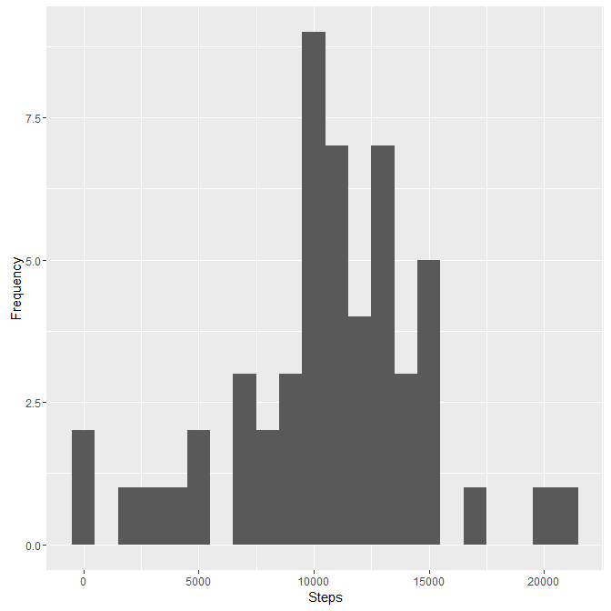
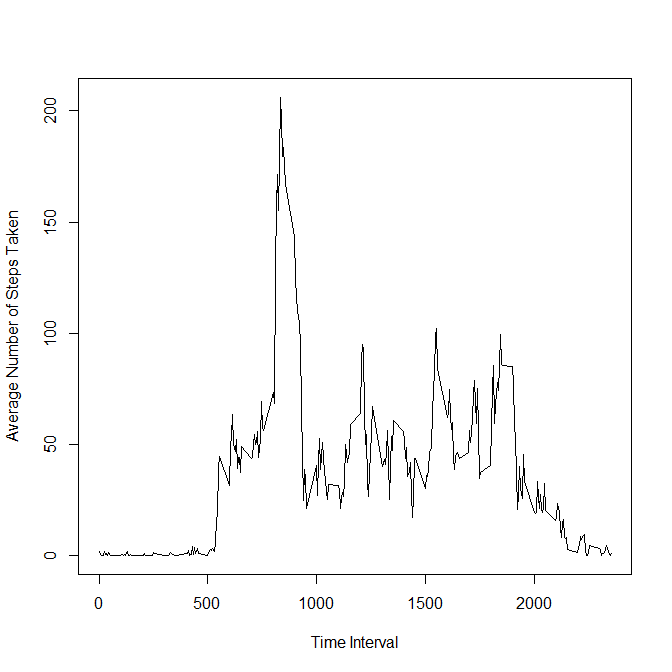
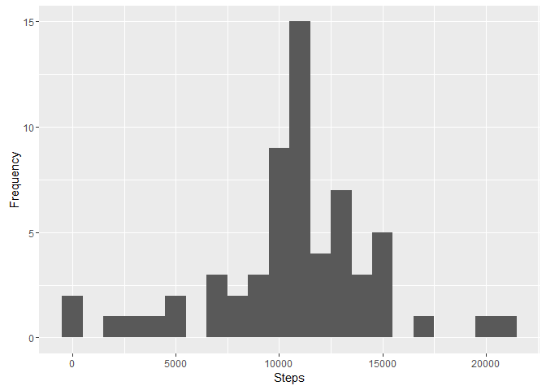

# Reproducible Research: Peer Assessment 1
Jack Palmer  
August 6, 2016  


```r
library(ggplot2)
```

```
## Warning: package 'ggplot2' was built under R version 3.1.3
```

Load the data


```r
temp <- tempfile()
download.file("https://d396qusza40orc.cloudfront.net/repdata%2Fdata%2Factivity.zip",temp)
```

```
## Warning in download.file("https://d396qusza40orc.cloudfront.net/repdata
## %2Fdata%2Factivity.zip", : downloaded length 53559 != reported length 53559
```

```r
data <- read.csv(unz(temp, "activity.csv"))
unlink(temp)
data$date <- as.Date(data$date)
```

## What is mean total number of steps taken per day?

Aggregate the steps by day to calculate the total number of steps taken by day.


```r
steps_by_day <- aggregate(data$steps, by = list(data$date), sum)
colnames(steps_by_day) <- c("date","steps")
```

We then make a histogram of the total number of steps taken each day.


```r
m <- ggplot(data=steps_by_day, aes(x=steps)) 
m + geom_histogram(binwidth = 1000) + xlab("Steps") + ylab("Frequency")
```

```
## Warning: Removed 8 rows containing non-finite values (stat_bin).
```

<!-- -->

Calculate and report the mean and median of the total number of steps taken per day.


```r
mean_steps_by_day <- mean(steps_by_day$x, na.rm = T)
```

```
## Warning in mean.default(steps_by_day$x, na.rm = T): argument is not numeric
## or logical: returning NA
```

```r
median_steps_by_day <- median(steps_by_day$x, na.rm = T)
```

```
## Warning in is.na(x): is.na() applied to non-(list or vector) of type 'NULL'
```

The mean number of steps taken each day is NA. The median number of steps taken each day is .

## What is the average daily activity pattern?

Make a time series plot (i.e. type = "l") of the 5-minute interval (x-axis) and the average number of steps taken, averaged across all days (y-axis)


```r
mean_steps_by_interval <- aggregate(data$steps, by = list(data$interval), mean, na.rm = T)
colnames(mean_steps_by_interval) <- c("interval","steps")
plot(mean_steps_by_interval$interval,mean_steps_by_interval$steps, type="l", xlab= "Time Interval", ylab= "Average Number of Steps Taken")
```

<!-- -->

Which 5-minute interval, on average across all the days in the dataset, contains the maximum number of steps?


```r
mean_steps_by_interval <- mean_steps_by_interval[order(-mean_steps_by_interval$steps), ]
top_interval <- mean_steps_by_interval$interval[1]
```

The interval 835 contains the maximum number of steps on average across all days.

## Imputing missing values

Calculate and report the total number of missing values in the dataset (i.e. the total number of rows with NAs)


```r
missing_values <- sum(is.na(data$steps))
```

There are 2304 missing values in the dataset.

Devise a strategy for filling in all of the missing values in the dataset. The strategy does not need to be sophisticated. For example, you could use the mean/median for that day, or the mean for that 5-minute interval, etc.

Create a new dataset that is equal to the original dataset but with the missing data filled in.


```r
data_cleaned <- merge(data,mean_steps_by_interval,by.x = c("interval"),by.y = c("interval"),all.x = T)
data_cleaned$steps <- ifelse(!is.na(data_cleaned$steps.x),data_cleaned$steps.x,data_cleaned$steps.y)
```


Make a histogram of the total number of steps taken each day and Calculate and report the mean and median total number of steps taken per day. Do these values differ from the estimates from the first part of the assignment? What is the impact of imputing missing data on the estimates of the total daily number of steps?

Aggregate the steps by day to calculate the total number of steps taken by day.


```r
steps_by_day_cleaned <- aggregate(data_cleaned$steps, by = list(data_cleaned$date), sum)
colnames(steps_by_day_cleaned) <- c("date","steps")
```


```r
m <- ggplot(data=steps_by_day_cleaned, aes(x=steps)) 
m + geom_histogram(binwidth = 1000) + xlab("Steps") + ylab("Frequency")
```

<!-- -->

Calculate and report the mean and median of the total number of steps taken per day.


```r
mean_steps_by_day_cleaned <- mean(steps_by_day_cleaned$steps, na.rm = T)
median_steps_by_day_cleaned <- median(steps_by_day_cleaned$steps, na.rm = T)
```

## Are there differences in activity patterns between weekdays and weekends?

Create a new factor variable in the dataset with two levels - "weekday" and "weekend" indicating whether a given date is a weekday or weekend day.


```r
data$dow <- ifelse(weekdays(data$date) == "Saturday" | weekdays(data$date) == "Sunday", "Weekend", "Weekday")
```

Make a panel plot containing a time series plot (i.e. type = "l") of the 5-minute interval (x-axis) and the average number of steps taken, averaged across all weekday days or weekend days (y-axis). See the README file in the GitHub repository to see an example of what this plot should look like using simulated data.


